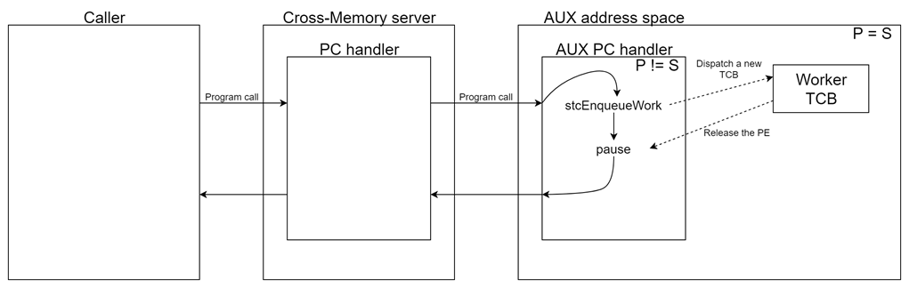

This program and the accompanying materials are
made available under the terms of the Eclipse Public License v2.0 which accompanies
this distribution, and is available at https://www.eclipse.org/legal/epl-v20.html

SPDX-License-Identifier: EPL-2.0

Copyright Contributors to the Zowe Project.

# ZSS AUX address spaces

## Overview

This is a framework that will allow the cross-memory server to start address spaces it can control and delegate work to.

A use case would be a system service that requires APF but can't run in cross-memory. Such service could run in an AUX address space and be invoked by the cross-memory server which would basically be a proxy for unauthorized users of that system service.



### Details

Components:
 * Master address space - the address space owning and controlling AUX address spaces (ZIS)
 * Host module - the generic load module used in AUX address spaces to control and host guest modules
 * Guest module - a load module loaded by the host module, which contains all the custom functionality such as: custom modify command handlers, work handlers, etc.

The code base:
 * AUX host code - the code of the generic AUX module
   * Allocates all resources for the address space
   * Loads the guest module
   * Handles communication with the cross-memory server (master)
 * AUX manager code - the code used by the master address space to:
   * Start/stop a new AUX address space
   * Send work and modify commands to its AUX address spaces
 * AUX guest code - the code used by guest modules
   * Test guest code - the code used to build the test guest module (ZWESAUXG)
   * Simple modify command handler (responds to DISPLAY) that returns a message with the address space's ASID
   * Work handler which reverts the content of the request payload

### Build
 * Clone the repos
```
git clone --recursive git@github.com:zowe/zss.git -b staging
git clone git@github.com:zowe/zowe-common-c.git -b staging
```
 * Go to the zss build directory
```
cd zss/build/
```
 * Run the zis ant file to build the host module (ZWESAUX)
```
./build_zis.sh
```
 * Go to the AUX test guest directory and build the guest module
```
cd ../test/aux-guest/build/
./build.sh
```

This program and the accompanying materials are
made available under the terms of the Eclipse Public License v2.0 which accompanies
this distribution, and is available at https://www.eclipse.org/legal/epl-v20.html

SPDX-License-Identifier: EPL-2.0

Copyright Contributors to the Zowe Project.

